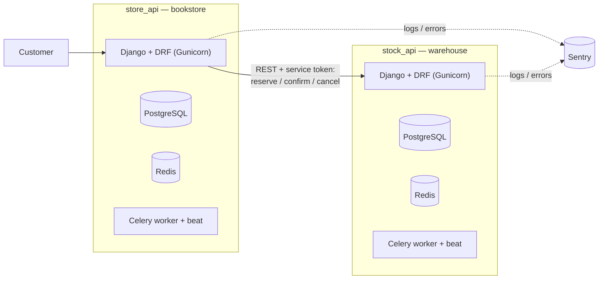

# Final project: store_api + stock_api

Two independent Django projects that talk to each other over REST API:

- **[store_api](store_api/README.md)** — the bookstore (catalog, cart, orders, Stripe payment, users). The main project (ProjectA), carrying over all the functionality from previous homeworks.
- **[stock_api](stock_api/README.md)** — the warehouse service (ProjectB): keeps track of book stock and reserves/deducts it when an order is placed in store_api.

## Architecture



When a customer places an order in `store_api`, it calls `stock_api` to reserve the needed books by their `isbn`. If card payment doesn't go through, the reservation is automatically canceled (a Celery task) and the stock is returned.

## Running the whole stack

```bash
docker compose -f final_project/docker-compose.yml up --build
```

- `store_api` — http://localhost:8000/, Swagger: http://localhost:8000/api/docs/
- `stock_api` — http://localhost:8001/, Swagger: http://localhost:8001/api/docs/

Each service can also be run on its own with its own `docker-compose.yml` (inside `store_api/` and `stock_api/`) — handy for working on one service without the other.

## Tests & CI/CD

Each service has its own GitHub Actions workflow (`.github/workflows/django.yml` for store_api, `.github/workflows/stock-api.yml` for stock_api): black → flake8 → pytest with coverage (minimum 80% / 70% respectively) → Docker image build and publish. Both services are integrated with Sentry (`SENTRY_DSN` in `.env_docker`).

## Status

Both services are implemented and covered by tests:
- `store_api` — all functionality from previous project but stock reservation via stock_api (see [store_api/README.md](store_api/README.md)).
- `stock_api` — stock tracking, reserve/confirm/cancel, automatic cancellation of stale reservations (see [stock_api/README.md](stock_api/README.md)).
