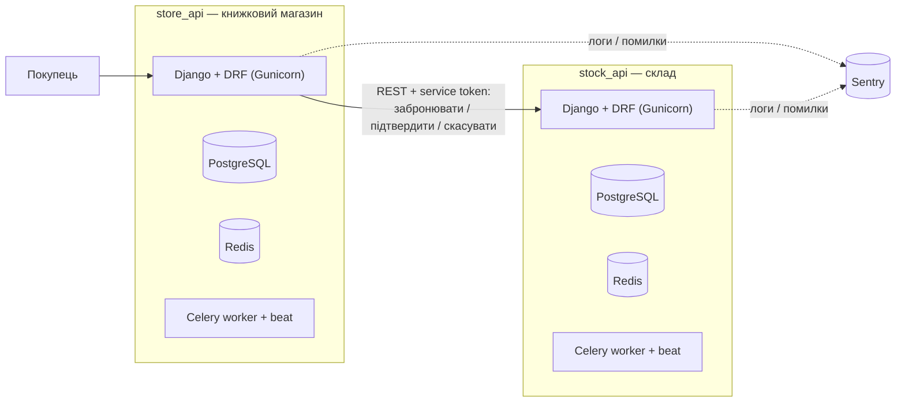

# Final project: store_api + stock_api

Два незалежні Django-проєкти, що спілкуються між собою через REST API:

- **[store_api](store_api/README.md)** — книжковий магазин (каталог, кошик, замовлення, оплата Stripe, користувачі). Основний проєкт (ProjectA), переносить весь функціонал попередніх ДЗ.
- **[stock_api](stock_api/README.md)** — сервіс складу (ProjectB): зберігає залишки книг і бронює/списує їх під час оформлення замовлення у store_api.

## Архітектура



Коли покупець оформлює замовлення в `store_api`, той звертається до `stock_api`, щоб зарезервувати потрібні книги за їхнім `isbn`. Якщо оплата карткою не відбудеться — бронь автоматично скасовується (Celery-задача), і залишок повертається на склад.

## Запуск усього стеку

```bash
docker compose -f final_project/docker-compose.yml up --build
```

- `store_api` — http://localhost:8000/, Swagger: http://localhost:8000/api/docs/
- `stock_api` — http://localhost:8001/, Swagger: http://localhost:8001/api/docs/

Кожен сервіс також можна піднімати окремо своїм власним `docker-compose.yml` (усередині `store_api/` і `stock_api/`) — зручно для розробки одного сервісу без другого.

## Тести й CI/CD

Кожен сервіс має свій GitHub Actions workflow (`.github/workflows/django.yml` для store_api, `.github/workflows/stock-api.yml` для stock_api): black → flake8 → pytest з покриттям (мінімум 80% / 70% відповідно) → збірка й публікація Docker-образу. Обидва сервіси інтегровані з Sentry (`SENTRY_DSN` у `.env_docker`).

## Статус

Обидва сервіси реалізовані та покриті тестами:
- `store_api` — весь функціонал попередніх ДЗ + резервування залишків через stock_api (див. [store_api/README.md](store_api/README.md)).
- `stock_api` — облік залишків, бронювання/підтвердження/скасування, автоматичне скасування протухлих броней (див. [stock_api/README.md](stock_api/README.md)).
